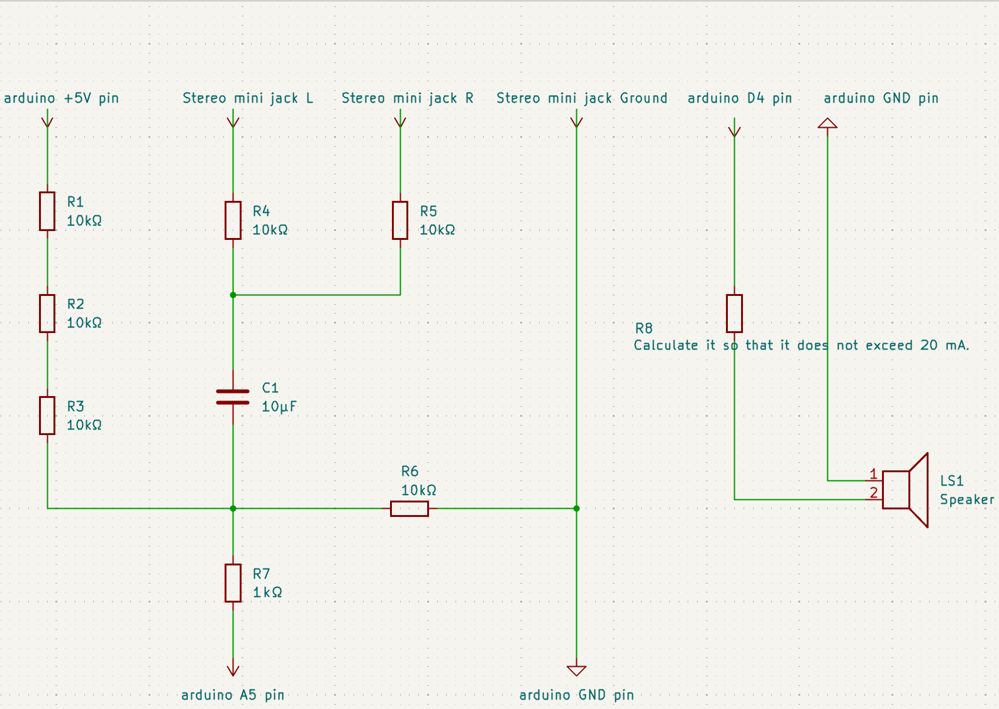

# Arduino Monophonic Real-Time Music Speaker

A simple monophonic real-time speaker system built with Arduino.  
This project uses a custom threshold-based algorithm to convert an analog input signal into a direct ON/OFF digital output.  
No PWM, no DAC — just pure logic-level switching.

## Overview
The Arduino continuously reads an analog input and compares it to a threshold.  
If the value is higher than the threshold, the output pin goes HIGH.  
If it is lower, the output pin goes LOW.

This produces a raw, square-like audio signal that reflects the transitions of the input waveform.

## Folder Structure
- `/src/` — Arduino code  
- `/circuit/` — Simple input circuit (if any)  
- `/notes/` — Experiment logs and observations

- ## X (Twitter)
Follow updates and experiments here:  
https://x.com/mmmmmm999i56897

